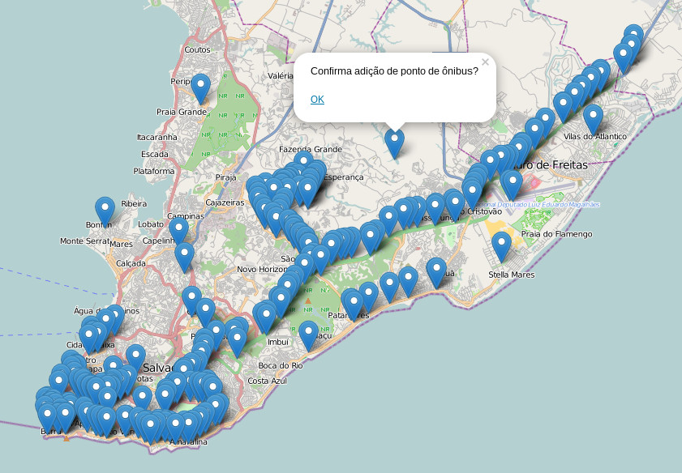

salvadorbus
===========

Tool to help mapping the bus stops of Salvador

The data was extracted from OpenStreetMap database through (http://overpass-turbo.eu/s/1KA)[a query on Overpass Turbo].

The aim is to make a crowdsourcing tool to map the bus stops of Salvador (Bahia - Brazil). What we need to develop now is the integration with the OSM edit API.
